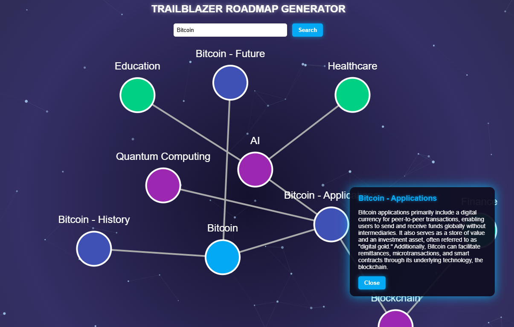

# Trailblazer: AI-Powered Mind Map Search Engine

**Trailblazer** is an innovative search engine that uses AI to deliver results in a mind map format, allowing users to explore the web in a visually engaging way. By organizing search results into dynamic mind maps, Trailblazer offers a unique approach to finding information quickly and intuitively. Powered by AI, it offers intelligent recommendations, interactive visuals, and real-time updates.

---

## 📱 Overview

Trailblazer redefines the way you search. Unlike traditional search engines, Trailblazer presents results in a mind map format that allows users to easily visualize relationships between concepts. It's designed for anyone who wants to explore search results in a more structured and creative way.

Inspired by the need for a more engaging, visually-organized search experience, Trailblazer is powered by AI to automatically generate relevant nodes, suggest related topics, and provide intelligent insights about your queries.

---

## 🌐 Access the Live Demo

🚀 Try out the Trailblazer search engine live:

🔗 [Live Trailblazer Demo](https://super-cheesecake-731ed1.netlify.app/et1)

---

## 🚀 Features

- 🤖 **AI-Powered Search**  
  Get intelligent search results with AI suggestions, related topics, and dynamic mind map generation.

- 🧠 **Mind Map Results**  
  Search results are displayed in an interactive mind map, making it easy to explore related topics.

- 🔄 **Real-Time Updates**  
  Results are updated in real time as you interact with the mind map, providing an intuitive search experience.

- 🧑‍💻 **Advanced Query Understanding**  
  Our AI understands the context of your search, returning results based on deeper analysis of your query.

- 🔄 **Topic Recommendations**  
  Trailblazer will suggest new topics and ideas related to your search, encouraging exploration.

- 📂 **Organized Results**  
  Results are grouped and organized based on relevance and relationships, providing a more structured search experience.

---

## ⚒️ How We Built It

Trailblazer was created to enhance the traditional search engine by combining the power of mind maps with AI. We wanted to make it easier for users to explore and visualize information dynamically. The platform is built to be fast, interactive, and powered by modern web technologies.

- 🔹 **Frontend:** Uses HTML, CSS, and JavaScript for responsive, user-friendly interaction.
- 🔹 **AI Integration:** Powered by OpenAI’s GPT models for contextual understanding and intelligent result suggestions.
- 🔹 **Mind Map Library:** Custom JavaScript mind map visualization for interactive, scalable results.

---

## 🧠 AI Integration

- **OpenAI API** – Handles query analysis, context understanding, and intelligent search suggestions.
- **Custom Algorithms** – Used to organize search results into a meaningful, visually engaging mind map format.

---

## 🔧 Tech Stack

- **Frontend:** HTML, CSS, JavaScript
- **Mind Map Visualization:** Custom JavaScript mind map physics
- **AI:** OpenAI GPT-3/4 API
- **Search Indexing:** Powerful search indexing and querying.
- **Deployment:** Netlify (Frontend)

---

## 🔥 Challenges We Faced

- ⏳ **Complexity of Search Result Organization:** Designing an intuitive, interactive mind map for displaying search results was a challenge.
- 💡 **Real-Time AI Suggestions:** Creating an AI model that could provide intelligent, real-time suggestions while maintaining search relevance.
- 🌐 **Scalability of Search Results:** Optimizing the system to handle millions of search queries while maintaining fast, responsive results.
- 📦 **User Experience:** Making the UI simple and intuitive despite the complexity of the underlying system.

---

## 🎓 What We Learned

Working on **Trailblazer** taught us invaluable lessons about:

- 👥 **AI and Search Technologies:** We learned how AI can enhance search engines, from query understanding to result suggestion.
- ⚙️ **Mind Map Visualization:** Understanding how visualizing data differently can enhance user experience and comprehension.
- 🧑‍💻 **Frontend and Backend Integration:** Seamlessly integrating AI, search engines, and mind map visualization on the web.
- 🗣️ **Collaborative Problem Solving:** Collaborating with different team members with different expertise areas (AI, front-end, back-end) to solve complex problems.

---

## 🔮 What's Next for Trailblazer

- 📁 **Multi-Language Support**  
  Expand the search engine to support multiple languages, enabling global access.

- 🌎 **Localized Search Results**  
  Provide region-specific results to tailor the search experience.

- 🧠 **Enhanced AI Features**  
  Add more AI-powered features, such as smarter query interpretation, sentiment analysis of results, and more.

- ☁️ **Cloud Synchronization**  
  Save your search sessions and mind map results to the cloud for easy access from anywhere.

- ⚙️ **Integration with External Data Sources**  
  Integrate with other knowledge databases, such as Wikipedia, academic papers, and open data sources.

---

## 👨‍💻 Developers

- **Owen Benedict Tanjung** — Fullstack Developer
- **Cornelius Edgar Sanjoyo** — UI/UX Designer
- **Kennard Kustiadi** — AI Specialist

---

## 🔧 License

This project is licensed under the **MIT License**.

---
